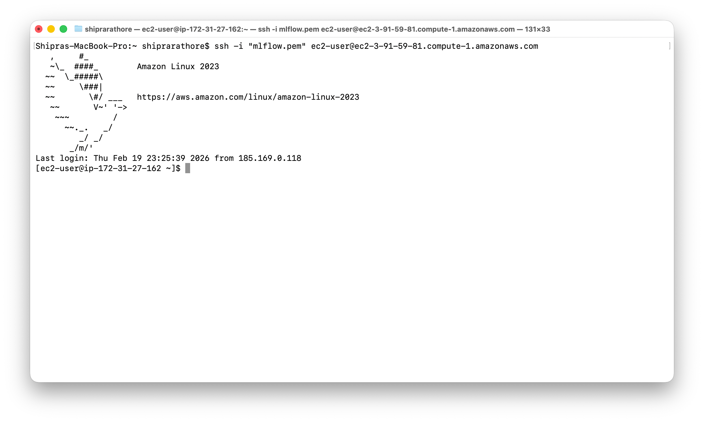

# MLflow and BentoML Setup and IRIS data Experiment

# Objective
 
 - Setup an EC2 Instance where I setup mlflow for experiment tracking and BentoML for turning our machine learning model into production-ready API.

# Steps:
1. Setup AWS EC2 Instance:
 I created an AWS EC2 Virtual Machine for this Project.

 - Go to AWS console > Search EC2 > Launch Instance > Choose instance type of your choice(I used t2.micro) > key pair > Security group > Launch Instance

 - Connect to created Instance by using ssh command from you AWS CLI from local terminal.
  
  ''' ssh -i "path/to/Key/KEYPAIR.pem" ec2-user@EC2INstance.compute-1.amazonaws.com '''

  
